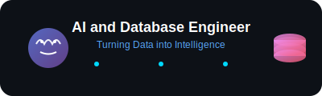

<div align="center">




</div>

---

<div align="center">

### 🧠 **AI • Databases • Data Science**
*Turning data into insights, one algorithm at a time*


[](https://github.com/roshan1595)
[](https://linkedin.com/in/roshan1595)

</div>

---

## 🛠️ **Tech Arsenal**

<div align="center">

### **Languages & Frameworks**


### **AI & Data Science**


### **Databases & Cloud**


</div>

---

## 🎯 **What I'm Building**

<table>
<tr>
<td width="50%">

### 🌦️ **Weather Data Analytics**
Building comprehensive weather analysis dashboards with **Streamlit** and **Altair**. Real-time data visualization that makes weather patterns come alive!

**Tech:** Python • Streamlit • Altair • Data Analysis

</td>
<td width="50%">

### 🔮 **AI-Powered Solutions**
Developing intelligent systems that learn, adapt, and solve real-world problems using cutting-edge machine learning techniques.

**Tech:** AI/ML • Deep Learning • Neural Networks

</td>
</tr>
</table>

---

## 📊 **GitHub Analytics**

<div align="center">


</div>

---

## 🎓 **Academic Journey**

<div align="center">

**🏫 University of Scranton** | *Scranton, PA*  
Exploring the intersection of **Computer Science** and **Data Analytics**


</div>

---

## 🌟 **Current Focus**

```python
class RoshanSingh:
    def __init__(self):
        self.name = "Roshan Kumar Singh"
        self.role = "AI & Database Engineer"
        self.location = "Scranton, PA"
        self.current_focus = [
            "Machine Learning Algorithms",
            "Database Optimization",
            "Data Visualization",
            "Cloud Computing"
        ]
        self.learning = ["Advanced AI", "Big Data", "MLOps"]
    
    def say_hi(self):
        print("Thanks for dropping by! Let's build something amazing together! 🚀")

me = RoshanSingh()
me.say_hi()
```

---

## 🤝 **Let's Connect!**

<div align="center">

[](https://linkedin.com/in/roshan1595)
[](https://github.com/roshan1595)
[](mailto:roshan@xaltrax.com)

**💡 "Data is the new oil, and I'm here to refine it into insights!"**

---


</div>